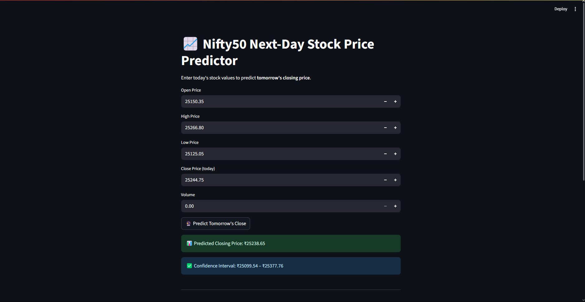

# 📈 Stock Price Predictor: Time Series Forecasting on Nifty50

Predict the **next-day closing price** of the Nifty50 index using historical data and a trained Linear Regression model — all deployed in a Streamlit web app.

---

## 🚀 Demo Screenshot



---

## 🧠 Features Used

- **Open, High, Low, Volume**
- **Volatility** = High – Low  
- **Day_Return** = (Close – Open) / Open  
- **DayOfWeek** = Numeric weekday (0 = Monday, 6 = Sunday)

---

## 🧪 Model Type

- **Linear Regression** (from Scikit-learn)

> LSTM was tested, but Linear Regression gave **lower RMSE**, so it was selected as the final model.

---

## 📊 Performance Metrics

| Metric               | Value              |
|----------------------|--------------------|
| **RMSE**             | ~190.75            |
| **MAE**              | ~145.6             |
| **Confidence Range** | `Prediction ± MAE` |

---

## 📦 Folder Structure

```plaintext
project-root/
├── app.py                         # Streamlit App
├── metrics.pkl                    # Stored RMSE and MAE
├── NIFTY 50.csv                   # Downloaded raw dataset
├── requirements.txt               # App dependencies
├── screenshot.png                 # (Optional) App UI demo
├── stock_cleaned_features.ipynb   # Program to clean dataset
├── stock_cleaned.csv              # Cleaned dataset
├── stock_model.ipynb              # Linear Regression model training
├── stock_lr_model.pkl             # Saved model for deployment
└── README.md
````

---

## ▶️ How to Run Locally

1. Clone the repo

   ```bash
   git clone https://github.com/BakaLuffy04/Stock_Predictor_App
   cd stock_predictor_app/
   ```

2. Install dependencies

   ```bash
   pip install -r requirements.txt
   ```

3. Run Streamlit app

   ```bash
   streamlit run app.py
   ```

---

## 🧪 Sample Output (Web App)

```
📊 Predicted Closing Price: ₹25238.65
✅ Confidence Interval: ₹25099.54 – ₹25377.76
```

---

## 🛠 Built With

* Python • Pandas • NumPy • Scikit-learn • Streamlit
* Matplotlib • Joblib

---

## 📬 Contact

Made by [@SparshJindal](https://github.com/BakaLuffy04)
Let me know if you use this or build on top of it!

```
